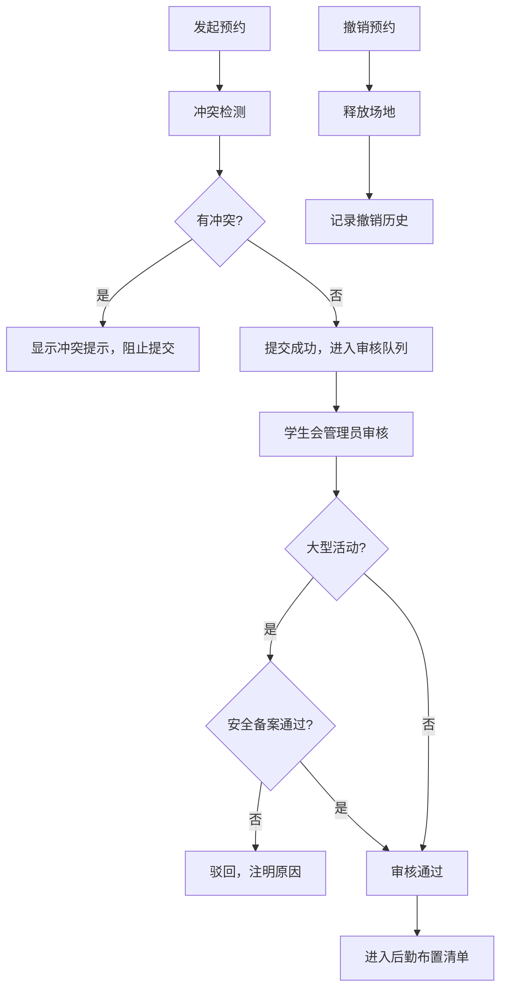

## 1. 产品概述

校园社团活动场地预约系统，解决校园内教室、操场、报告厅等场地的预约、审核、布置全流程管理问题。面向社团负责人、学生会管理员、后勤人员三类角色，实现场地资源高效分配与冲突自动检测。

- 主要目的：统一管理校园场地资源，避免预约冲突，规范审核流程
- 目标用户：社团负责人（预约方）、学生会管理员（审核方）、后勤人员（执行方）
- 产品价值：提升场地使用效率，减少人工协调成本，实现全流程可追溯

## 2. 核心功能

### 2.1 用户角色

| 角色 | 核心权限 |
|------|----------|
| 社团负责人 | 浏览场地日历、提交预约申请、撤销自己的预约、查看预约状态 |
| 学生会管理员 | 维护活动类型、审核预约队列、标记安全备案状态、通过/驳回预约 |
| 后勤人员 | 查看需要布置的场地清单、标记布置完成状态 |

### 2.2 功能模块

1. **场地日历**：按月/周/日视图展示各场地的预约占用情况
2. **预约表单**：选择场地、时间段、填写活动信息、提交预约
3. **冲突提示**：实时检测时间段冲突，可视化展示冲突详情
4. **审核队列**：展示待审核预约列表，支持通过/驳回操作
5. **布置清单**：展示审核通过且需要布置的场地任务
6. **撤销记录**：展示所有撤销的预约记录，保留历史痕迹

### 2.3 页面详情

| 页面名称 | 模块名称 | 功能描述 |
|---------|----------|---------|
| 场地日历 | 日历视图 | 按场地分类展示预约状态，支持日/周/月切换，点击空闲时段可快速发起预约 |
| 场地日历 | 场地筛选 | 按类型（教室/操场/报告厅）筛选场地，支持搜索 |
| 预约表单 | 场地选择 | 下拉选择具体场地，显示场地容量和设施 |
| 预约表单 | 时间选择 | 日期选择器 + 时间段选择，精确到半小时 |
| 预约表单 | 活动信息 | 活动名称、活动类型、参与人数、负责人联系方式 |
| 预约表单 | 冲突检测 | 提交前实时检测，有冲突时阻止提交并高亮冲突时段 |
| 审核队列 | 待审列表 | 展示待审核预约，显示活动类型、安全备案状态 |
| 审核队列 | 审核操作 | 通过/驳回按钮，驳回需填写原因，大型活动需检查安全备案 |
| 审核队列 | 活动类型维护 | 新增/编辑/停用活动类型，设置是否为大型活动 |
| 布置清单 | 任务列表 | 按日期排序展示需要布置的场地，显示时间、场地、活动要求 |
| 布置清单 | 状态标记 | 标记为"已布置"，过滤已完成任务 |
| 撤销记录 | 记录列表 | 展示所有撤销的预约，显示撤销原因、撤销人、原预约信息 |
| 撤销记录 | 场地释放说明 | 可视化展示撤销后场地已释放可供重新预约 |

## 3. 核心流程

### 3.1 预约流程

社团负责人浏览场地日历 → 选择空闲时段 → 填写预约表单 → 系统检测冲突 → 无冲突则提交成功进入审核队列 → 学生会管理员审核 → 审核通过后进入后勤布置清单 → 活动结束后自动释放场地

### 3.2 审核流程

学生会管理员查看审核队列 → 检查活动类型（大型活动需验证安全备案）→ 未通过安全备案的大型活动直接驳回 → 通过或驳回预约 → 同步更新场地状态

### 3.3 撤销流程

社团负责人撤销已提交的预约 → 系统记录撤销原因 → 释放场地时段 → 保留撤销记录供审计

### 3.4 核心规则

1. **冲突检测规则**：同一时间段内同一场地不能重复预约，精确到分钟级的时间段重叠检测
2. **大型活动审核规则**：标记为"大型活动"的类型必须通过安全备案才能审核通过
3. **撤销规则**：撤销预约立即释放场地，但撤销记录永久保留，包含撤销原因和时间戳

## 4. 用户界面设计

### 4.1 设计风格

- **主色调**：校园青春风格，采用深邃蓝 `#1e3a5f` 作为主色，搭配活力橙 `#ff6b35` 作为强调色
- **辅助色**：成功绿 `#10b981`、警告黄 `#f59e0b`、危险红 `#ef4444`
- **中性色**：浅灰 `#f8fafc`、中灰 `#64748b`、深灰 `#1e293b`
- **按钮风格**：圆角 8px，悬停时有轻微上浮效果和阴影变化
- **字体**：标题使用 "Noto Sans SC" 700，正文使用 "Noto Sans SC" 400
- **布局风格**：顶部导航 + 侧边角色切换 + 主内容区卡片式布局
- **图标**：使用 lucide-react 线性图标，统一 20px 尺寸

### 4.2 页面设计概览

| 页面名称 | UI 元素 |
|---------|---------|
| 场地日历 | 顶部月历导航，主体网格布局，不同状态使用不同颜色块标注，悬停显示详情弹窗 |
| 预约表单 | 双列布局，左侧场地信息，右侧表单填写，冲突时红色边框抖动动画 |
| 审核队列 | 表格布局，每行有快速操作按钮，大型活动有特殊徽章标识 |
| 布置清单 | 时间轴式布局，按日期分组，卡片式展示每个任务 |
| 撤销记录 | 列表布局，灰色调显示，有删除线视觉效果表示已失效 |

### 4.3 响应式设计

- 桌面端（默认）：侧边栏 + 主内容区双栏布局
- 平板端：侧边栏可折叠，主内容区自适应
- 移动端：顶部导航下拉菜单，卡片垂直堆叠

### 4.4 动效设计

- 页面加载：元素淡入 + 轻微上移动画，stagger 延迟 50ms
- 冲突提示：红色边框脉冲动画 + 轻微抖动
- 审核操作：按钮点击后缩放反馈 + 状态切换滑入动画
- 日历切换：左右滑动过渡效果
