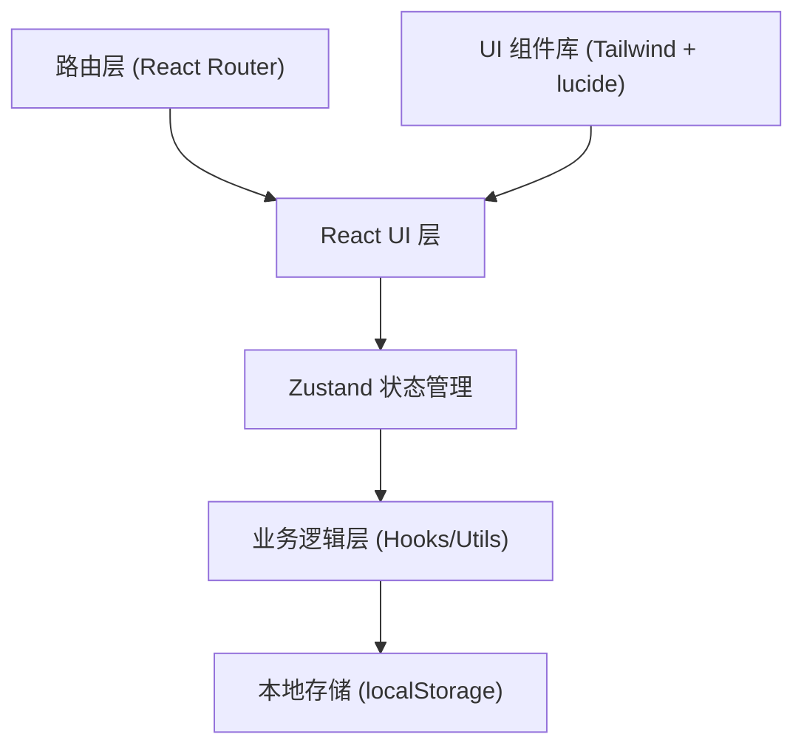
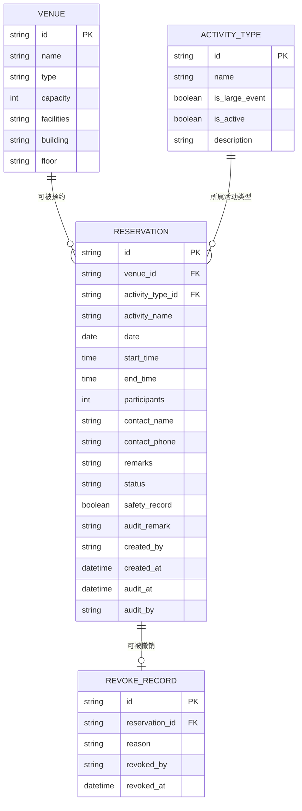

## 1. 架构设计

纯前端单页应用，使用本地状态管理模拟后端，数据持久化到 localStorage。



## 2. 技术描述

- **前端框架**：React@18 + TypeScript
- **构建工具**：Vite@5
- **样式方案**：Tailwind CSS@3
- **状态管理**：Zustand@4
- **路由管理**：react-router-dom@6
- **图标库**：lucide-react@0.344
- **日期处理**：date-fns@3
- **数据持久化**：localStorage（模拟后端）
- **后端**：无，纯前端实现

## 3. 路由定义

| 路由路径 | 页面组件 | 权限角色 |
|---------|---------|---------|
| `/` | 场地日历页 | 所有角色 |
| `/reserve` | 预约表单页 | 社团负责人 |
| `/audit` | 审核队列页 | 学生会管理员 |
| `/setup` | 布置清单页 | 后勤人员 |
| `/revoke` | 撤销记录页 | 所有角色 |

## 4. 数据模型

### 4.1 数据模型定义



### 4.2 状态管理设计

```typescript
// 场地类型
interface Venue {
  id: string;
  name: string;
  type: 'classroom' | 'playground' | 'lecture_hall';
  capacity: number;
  facilities: string[];
  building: string;
  floor: string;
}

// 活动类型
interface ActivityType {
  id: string;
  name: string;
  isLargeEvent: boolean;
  isActive: boolean;
  description: string;
}

// 预约状态
type ReservationStatus = 'pending' | 'approved' | 'rejected' | 'revoked' | 'setup_completed';

// 预约记录
interface Reservation {
  id: string;
  venueId: string;
  activityTypeId: string;
  activityName: string;
  date: string;
  startTime: string;
  endTime: string;
  participants: number;
  contactName: string;
  contactPhone: string;
  remarks: string;
  status: ReservationStatus;
  safetyRecord: boolean;
  auditRemark: string;
  createdBy: string;
  createdAt: string;
  auditAt?: string;
  auditBy?: string;
}

// 撤销记录
interface RevokeRecord {
  id: string;
  reservationId: string;
  reason: string;
  revokedBy: string;
  revokedAt: string;
}

// 用户角色
type UserRole = 'club_leader' | 'admin' | 'logistics';

// 全局状态
interface AppState {
  currentRole: UserRole;
  venues: Venue[];
  activityTypes: ActivityType[];
  reservations: Reservation[];
  revokeRecords: RevokeRecord[];
  selectedDate: string;
  selectedVenueId: string | null;
  conflictInfo: ConflictInfo | null;
}
```

### 4.3 核心工具函数

```typescript
// 冲突检测
function checkConflict(
  reservations: Reservation[],
  venueId: string,
  date: string,
  startTime: string,
  endTime: string,
  excludeId?: string
): ConflictInfo | null;

// 时间重叠判断
function isTimeOverlap(
  start1: string,
  end1: string,
  start2: string,
  end2: string
): boolean;

// 大型活动审核校验
function canApproveReservation(
  reservation: Reservation,
  activityType: ActivityType
): { allowed: boolean; reason: string };

// 按日期获取场地预约
function getReservationsByVenueAndDate(
  reservations: Reservation[],
  venueId: string,
  date: string
): Reservation[];
```

### 4.4 初始化数据

预置以下测试数据用于验收场景：

- 场地：3个教室、2个操场、1个报告厅
- 活动类型：社团例会、学术讲座、文艺演出（大型）、体育比赛（大型）
- 预约记录：预置一条 2026-06-10 14:00-16:00 的预约，用于冲突测试
- 用户角色切换：模拟三个角色的登录状态
